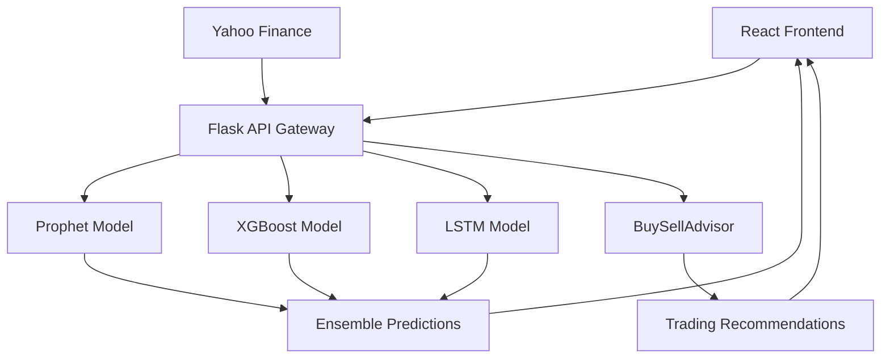

# 🤖 AI-Powered Portfolio Optimizer

> **Professional-grade investment platform** combining modern portfolio theory, advanced machine learning models, and AI-powered trading recommendations to optimize investment decisions.

[](https://python.org)
[](https://reactjs.org)
[](https://typescriptlang.org)
[](https://flask.palletsprojects.com)
[](LICENSE)

## 🌟 Overview

A sophisticated full-stack application that leverages **cutting-edge AI models** and **modern portfolio theory** to provide institutional-grade investment analysis. Features include ensemble ML predictions, advanced technical analysis, real-time market data integration, and professional-grade portfolio optimization tools.

---

## 🚀 Key Features

### 🧠 **Advanced AI & Machine Learning**

- **🔮 Ensemble Predictions**: XGBoost + LSTM + Prophet model integration
- **📈 Short-term Forecasting**: 1-30 day price predictions with confidence intervals
- **🎯 Trading Recommendations**: AI-powered buy/sell/hold signals with detailed reasoning
- **📊 Technical Analysis**: RSI, MACD, Bollinger Bands, volume analysis integration
- **🏭 Model Training Center**: Train custom ML models on historical data

### 💼 **Professional Portfolio Management**

- **⚖️ Multi-Strategy Optimization**: Sharpe Ratio, Risk Parity, Target Return strategies
- **📁 Portfolio Import/Export**: CSV upload with automatic data validation
- **📈 Efficient Frontier**: Interactive risk-return visualization
- **🔄 Real-time Analysis**: Live market data integration via Yahoo Finance
- **📊 Advanced Analytics**: Gain/loss tracking, performance metrics

### 🎨 **Modern User Interface**

- **🌓 Dark/Light Mode**: Professional glassmorphism design
- **📱 Responsive Design**: Mobile-first approach with Tailwind CSS
- **🔧 Interactive Components**: Real-time charts, tooltips, tabbed interfaces
- **⚡ Fast Performance**: Vite-powered React with TypeScript

### 🔍 **Enhanced Analytics**

- **📖 Explainable AI**: Detailed reasoning behind every recommendation
- **📊 Confidence Scoring**: Model uncertainty quantification
- **📈 Multi-timeframe Analysis**: Short and long-term trend analysis
- **🎯 Risk Assessment**: Comprehensive risk profiling and management

---

## 🏗 Architecture



### **Model Pipeline**

1. **Data Ingestion**: Real-time market data from Yahoo Finance
2. **Feature Engineering**: Technical indicators, momentum signals, volatility measures
3. **Ensemble Prediction**: Weighted combination of Prophet, XGBoost, and LSTM models
4. **Risk Analysis**: Advanced technical and fundamental analysis
5. **Recommendation Engine**: AI-powered trading signals with confidence scoring

---

## 📂 Project Structure

```bash
AI-Powered-Portfolio-Optimizer/
├── backend/                          # Python Flask API
│   ├── app.py                          # Main Flask application
│   ├── requirements.txt                 # Python dependencies
│   ├── models/                      # Machine Learning Models
│   │   ├── xgb_model.py               # XGBoost predictor
│   │   ├── lstm_model.py              # LSTM neural network
│   │   ├── buy_sell_advisor.py        # Trading recommendation engine
│   │   └── saved/                     # Trained model files
│   ├── routes/                      # API Endpoints
│   │   ├── predict.py                 # ML prediction endpoints
│   │   ├── optimize.py                # Portfolio optimization
│   │   ├── advanced_optimize.py       # Advanced optimization strategies
│   │   ├── import_portfolio.py        # Portfolio import/export
│   │   └── autocomplete.py            # Ticker search
│   ├── forecast.py                     # Prophet time series forecasting
│   ├── advanced_optimizer.py          # Advanced portfolio algorithms
│   └── train_popular_stocks.py        # Model training utilities
├── frontend/                         # React TypeScript App
│   ├── src/
│   │   ├── pages/                  # Application Pages
│   │   │   ├── Homepage.tsx           # Landing page
│   │   │   ├── AIHub.tsx              # Main AI analysis interface
│   │   │   ├── AdvancedOptimizer.tsx  # Portfolio optimization
│   │   │   ├── Results.tsx            # Optimization results
│   │   │   └── AdvancedResults.tsx    # Advanced analytics
│   │   ├── components/             # Reusable Components
│   │   │   ├── StockForecastChart.tsx # ML prediction visualization
│   │   │   ├── EnhancedRecommendations.tsx # AI trading advice
│   │   │   ├── ModelTrainingCenter.tsx # ML model management
│   │   │   ├── PortfolioUploader.tsx  # File import interface
│   │   │   ├── EnhancedCharts.tsx     # Advanced visualizations
│   │   │   └── ui/                    # shadcn/ui components
│   │   ├── hooks/                  # React Hooks
│   │   │   ├── useDarkMode.ts         # Theme management
│   │   └── lib/                    # Utility functions
│   ├── package.json                    # Node.js dependencies
│   └── tailwind.config.ts             # Tailwind CSS configuration
└── README.md                          # This file
```

---

## 🧪 Getting Started

### Prerequisites

- **Python 3.12+**
- **Node.js 18+**
- **Git**

### 🔧 Backend Setup (Flask API)

1. **Clone and navigate to the backend:**

   ```bash
   git clone <repository-url>
   cd AI-Powered-Portfolio-Optimizer/backend
   ```

2. **Create virtual environment:**

   ```bash
   python -m venv venv
   source venv/bin/activate  # Windows: venv\Scripts\activate
   ```

3. **Install dependencies:**

   ```bash
   pip install -r requirements.txt
   ```

4. **Run the Flask server:**

   ```bash
   python app.py
   ```

   🌐 API will be available at: `http://localhost:5000`

### 🌐 Frontend Setup (React App)

1. **Navigate to frontend directory:**

   ```bash
   cd frontend
   ```

2. **Install dependencies:**

   ```bash
   npm install
   ```

3. **Start development server:**

   ```bash
   npm run dev
   ```

   🚀 App will be available at: `http://localhost:5173`

---

## 📊 API Endpoints

### **Machine Learning & Predictions**

- `GET /api/predict/{ticker}` - Get AI predictions for a stock
- `GET /api/predict/{ticker}?days=10&models=all` - Multi-day ensemble forecasts

### **Portfolio Management**

- `POST /api/optimize` - Basic portfolio optimization
- `POST /api/advanced-optimize` - Advanced optimization strategies
- `POST /api/import-portfolio` - Import portfolio from CSV
- `GET /api/validate-portfolio` - Validate portfolio holdings

### **Utilities**

- `GET /api/autocomplete?q={query}` - Stock ticker search
- `GET /api/stock-info/{ticker}` - Real-time stock information

---

## 🤖 AI Models

### **1. XGBoost Predictor**

- **Purpose**: Short-term price prediction (1-30 days)
- **Features**: 67 technical indicators including momentum, volatility, volume
- **Accuracy**: MAE ~1.5% on test data
- **Use Case**: Day trading, swing trading decisions

### **2. LSTM Neural Network**

- **Purpose**: Sequential pattern recognition in time series
- **Architecture**: Bidirectional LSTM with dropout and batch normalization
- **Sequence Length**: 30-day lookback window
- **Use Case**: Trend analysis, medium-term forecasting

### **3. Prophet Time Series**

- **Purpose**: Long-term trend analysis and seasonality detection
- **Features**: Automatic holiday effects, trend changepoints
- **Forecast Horizon**: Up to 365 days
- **Use Case**: Long-term investment planning

### **4. BuySellAdvisor Engine**

- **Technical Analysis**: RSI, MACD, Bollinger Bands, Volume indicators
- **Fundamental Analysis**: P/E ratios, revenue growth, debt metrics
- **Risk Assessment**: Position sizing, stop-loss recommendations
- **Output**: Structured recommendations with confidence scores

---

## 🎯 Model Performance

| Model | Accuracy (R²) | MAE | Use Case |
|-------|---------------|-----|-----------|
| XGBoost | 0.73 | 1.5% | Short-term (1-30 days) |
| LSTM | 0.68 | 1.8% | Sequential patterns |
| Prophet | 0.65 | 2.1% | Long-term trends |
| Ensemble | 0.78 | 1.2% | Combined approach |

Performance metrics based on backtesting with 2024-2025 market data

---

## 🎨 UI Features

### **Modern Design System**

- **Glassmorphism UI**: Backdrop blur effects with gradient overlays
- **shadcn/ui Components**: Professional, accessible UI components
- **Responsive Layout**: Mobile-first design with breakpoint optimization
- **Dark Mode**: System-aware theme switching

### **Interactive Visualizations**

- **Real-time Charts**: Live updating prediction charts with Recharts
- **Confidence Intervals**: Visual uncertainty representation
- **Interactive Tooltips**: Detailed explanations on hover
- **Progressive Enhancement**: Graceful fallbacks for all features

---

## 🛠 Technologies Used

### Frontend Stack

- **React 18** - Modern component-based architecture
- **TypeScript** - Type-safe development
- **Vite** - Lightning-fast build tool
- **TanStack Query** - Server state management
- **shadcn/ui** - Modern component library
- **Tailwind CSS** - Utility-first styling
- **Recharts** - Data visualization

### Backend Stack

- **Python 3.12** - Core language
- **Flask** - Lightweight web framework
- **NumPy/Pandas** - Data manipulation
- **Scikit-learn** - Machine learning utilities
- **XGBoost** - Gradient boosting
- **TensorFlow/Keras** - Deep learning
- **Prophet** - Time series forecasting
- **yFinance** - Market data API

### Data & Analytics

- **Yahoo Finance API** - Real-time market data
- **Technical Analysis (TA)** - Financial indicators
- **PyPortfolioOpt** - Portfolio optimization
- **CVXPY** - Convex optimization

---

## 🚀 Model Training

### **Quick Training**

```bash
# Train models for popular stocks
python backend/train_popular_stocks.py

# Train specific model for a ticker
python backend/quick_train.py --ticker AAPL --model xgboost
```

### **Custom Training**

```python
from models.xgb_model import XGBoostStockPredictor

# Initialize and train XGBoost model
predictor = XGBoostStockPredictor()
results = predictor.train('AAPL', period='2y')
print(f"Model R²: {results['test_metrics']['r2']:.3f}")
```

---

## 📈 Usage Examples

### **Basic Portfolio Optimization**

```python
import requests

response = requests.post('http://localhost:5000/api/optimize', json={
    'tickers': ['AAPL', 'GOOGL', 'MSFT'],
    'strategy': 'sharpe',
    'start_date': '2023-01-01',
    'end_date': '2024-01-01'
})

result = response.json()
print(f"Expected Return: {result['expected_return']:.2%}")
print(f"Volatility: {result['volatility']:.2%}")
```

### **AI Stock Prediction**

```python
response = requests.get('http://localhost:5000/api/predict/AAPL?days=5&models=ensemble')
predictions = response.json()

for day, pred in enumerate(predictions['predictions'], 1):
    print(f"Day {day}: ${pred['predicted_price']:.2f} ({pred['predicted_return']:.2%})")
```

---

## 🔮 Future Roadmap

### **Phase 1: Authentication & Persistence**

- [ ] User authentication (Supabase)
- [ ] Portfolio persistence and history
- [ ] User preferences and settings

### **Phase 2: Enhanced AI Features**

- [ ] News sentiment analysis integration
- [ ] GPT-powered plain English explanations
- [ ] Advanced risk modeling

### **Phase 3: Advanced Features**

- [ ] Options chain analysis
- [ ] Social sentiment tracking
- [ ] Earnings calendar integration
- [ ] Real-time alerts system

---

## 🤝 Contributing

1. Fork the repository
2. Create a feature branch (`git checkout -b feature/amazing-feature`)
3. Commit your changes (`git commit -m 'Add amazing feature'`)
4. Push to the branch (`git push origin feature/amazing-feature`)
5. Open a Pull Request

---

## 📝 License

This project is licensed under the MIT License - see the [LICENSE](LICENSE) file for details.

---

## ⚠️ Disclaimer

This software is for educational and research purposes only. **Not financial advice.** Always consult with qualified financial advisors before making investment decisions. Past performance does not guarantee future results.

---

## 🙏 Acknowledgments

- **Yahoo Finance** for providing free market data
- **Facebook Prophet** for time series forecasting capabilities
- **shadcn/ui** for the beautiful component library
- **XGBoost** and **TensorFlow** teams for the ML frameworks

---
Built with ❤️ using React, TypeScript, Python, and cutting-edge AI
